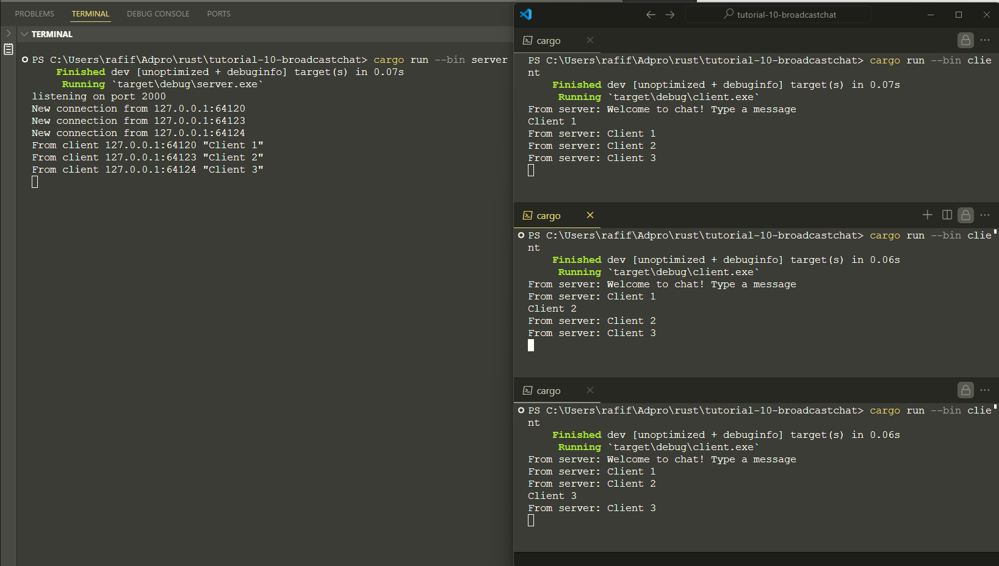
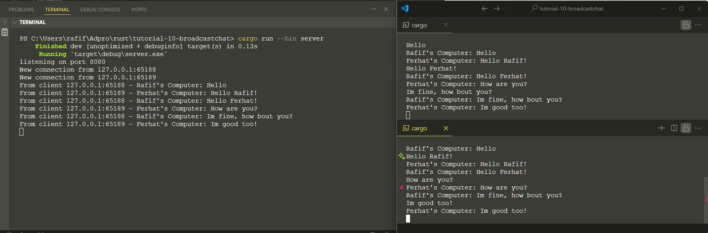
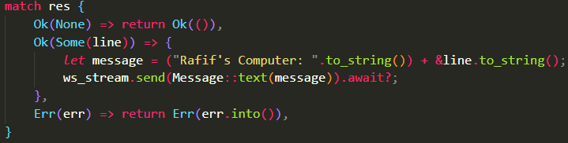
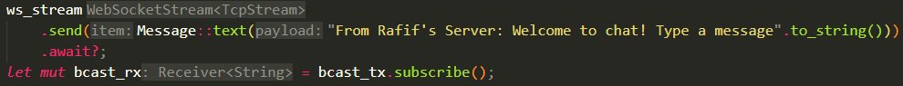

# Tutorial 10 - Broadcast Chat

## 2.1. Original code of broadcast chat

At first we start the server by running `cargo run --bin server` and then we start the client by running `cargo run --bin client`times with 3 different terminal. When we send message at one client, the server will broadcast the message to all clients.

## 2.2. Modifying the websocket port

At the client side, we can modify the websocket port by changing the `ClientBuilder::from_uri(Uri::from_static("ws://127.0.0.1:#PortNumber"))` in the `client.rs` file.

At the server side, we can modify the websocket port by changing the `TcpListener::bind("127.0.0.1:#PortNumber")` in the `server.rs` file.

## 2.3. Small changes. Add some information to client

I add some code so that it behaves like a chat client. When the client sends a message, it will display from which computer's the message is sent. So, I add client 2 with different computer name.

### Client

On client I add the computer's name to the sent message, so that the server can broadcast the message with the computer's name.

### Server

On server side I add those, so that the chat can see the server's name.